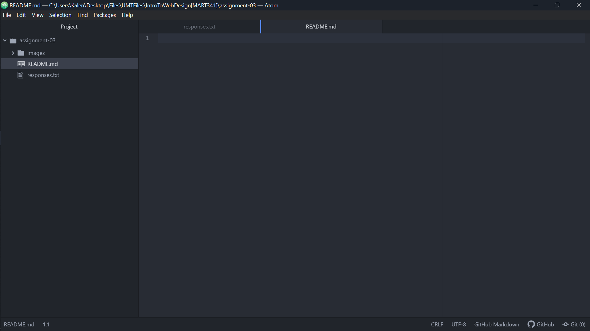

# Assignment 3
## Kalen Weinheimer

- Add a list of 3 things you’ve learned so far.

  1 - The different parts which make up a URL, the protocol, domain, path, and file.
  
  2 - How to read the additional contents of a URL, such as distinguishing a port, parameters, and an anchor.
  
  3 - The basics of the Markdown language, such as how to denote bold, italics, headers, and code.

External Website Links:

1 - [Nexus Mods](https://www.nexusmods.com/)

2 - [Youtube](https://www.youtube.com/)

3 - [Wikipedia](https://www.wikipedia.org/)

[Responses Text File Link](./responses.txt)

