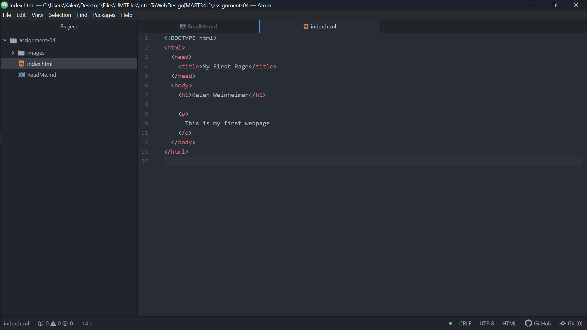

1 - Very briefly detail how browsers function. List any browsers you currently use to surf - or even develop for - the web.

  After a browser receives data from a server the HTML document is sent to the rendering engine which analyzes (parses) the document and converts the elements into DOM nodes, forming a DOM tree. At the same time, the browser also constructs a render tree which contains the visual elements of a page in the order which they will be displayed. The browser then goes through a layout process where the placements of objects is determined, and then this information is displayed onto the screen.

  I pretty much only use Google Chrome currently to browse the web, however, I did use a laptop with Linux in the past, and used Firefox then. I do also have Opera GX on my computer which I simply installed out of curiosity, and it does have some cool unique features, I just don't personally find much use for them.

2 - What is a markup language? Describe one commonly used in development.

  A markup language is a type of programming language that defines the text or contents of a web page. The most well known and widely used markup language is HTML (Hypertext Markup Language). HTML is used to render the content and page structure of a web page using a standardized element and tagging system.

3 - An embedded image of your screenshot using its relative URL.
	
