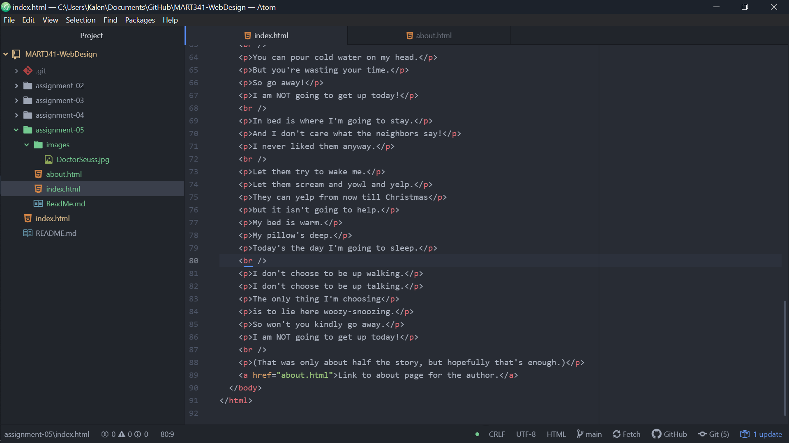

# Wayback Machine
I decided to look at Wikipedia on the wayback machine, and the oldest snapshot was from July 27, 2001. Rather than having any sort of search bar, there is simply a collection of hyper links grouped into categories such as Social Sciences and Culture. It was a rather plain looking page, but I can't say that's really changed any since then.

# Summary
So far most of the information learned has been review for me, however, horizontal rules and pre-rendered text are either new to me or have been forgotten.

